# SkillBridge

SkillBridge est une plateforme full-stack qui transforme une idee de projet en parcours d'apprentissage:

```text
Idee de projet -> competences detectees -> cours recommandes -> suivi de progression
```

Le projet combine une application web Spring Boot + React avec un laboratoire Big Data terminal-first base sur Sqoop, HDFS, Flume, Hive, MapReduce et HBase.

## Sommaire

- [1. Vue generale](#1-vue-generale)
- [2. Figures d'architecture](#2-figures-darchitecture)
- [3. Structure du repository](#3-structure-du-repository)
- [4. Stack technique](#4-stack-technique)
- [5. Configuration env](#5-configuration-env)
- [6. Frontend et parcours utilisateur](#6-frontend-et-parcours-utilisateur)
- [7. Backend et API](#7-backend-et-api)
- [8. Base de donnees](#8-base-de-donnees)
- [9. Pipeline Big Data](#9-pipeline-big-data)
- [10. Pipeline par use case](#10-pipeline-par-use-case)
- [11. Commandes de lancement](#11-commandes-de-lancement)
- [12. Verification locale](#12-verification-locale)
- [13. Points forts et limites](#13-points-forts-et-limites)

## 1. Vue generale

SkillBridge repond a un besoin simple: un utilisateur a une idee de projet, mais ne sait pas exactement quelles competences apprendre ni quels cours choisir. L'application permet de:

- creer un compte avec email/mot de passe, Google OAuth ou GitHub OAuth;
- saisir une idee de projet;
- detecter les competences importantes dans le texte;
- recommander des cours pertinents depuis un catalogue de plus de 17 000 cours;
- sauvegarder des cours;
- suivre la progression;
- administrer le catalogue;
- visualiser l'etat Big Data et les analytics.

Le principe d'architecture important est le suivant:

```text
React ne parle jamais directement a la base Supabase pour le workflow applicatif.
React appelle uniquement Spring Boot.
Spring Boot lit et ecrit dans Supabase PostgreSQL.
Le pipeline Big Data travaille surtout en terminal et expose ses resultats au backend via fichiers JSON/logs.
```

## 2. Figures d'architecture

### Figure 1 - Architecture globale

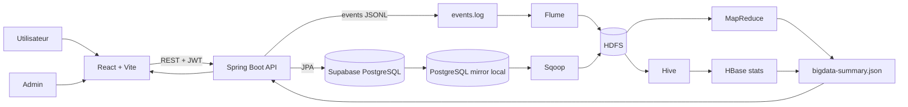

### Figure 2 - Separation application et Big Data

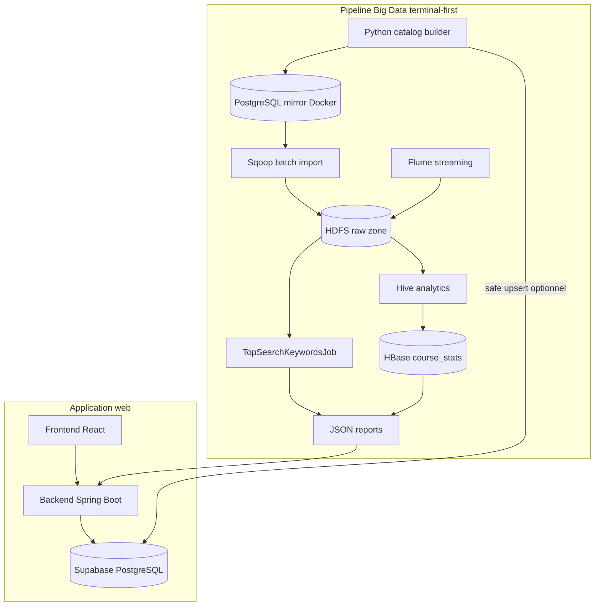

### Figure 3 - Flux projet vers recommandations

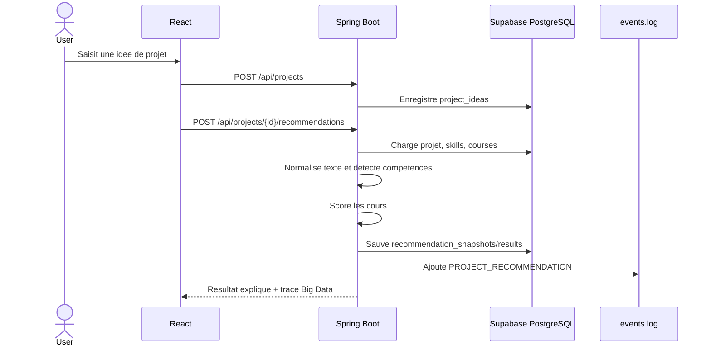

### Figure 4 - Flux catalogue Big Data

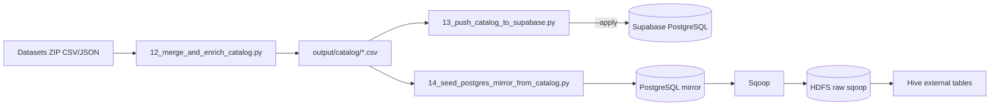

### Figure 5 - Flux streaming evenementiel

```mermaid
flowchart LR
    React[Actions utilisateur] --> API[Spring Boot]
    API --> LOG[apps/bigdata/data/events/events.log]
    LOG --> FLUME[Flume agent]
    FLUME --> HDFS[/data/skillbridge/raw/flume/events]
    HDFS --> MR[MapReduce keyword count]
    HDFS --> HIVE[Hive events table]
    MR --> SUMMARY[bigdata-summary.json]
    HIVE --> SUMMARY
```

### Figure 6 - Modele fonctionnel simplifie

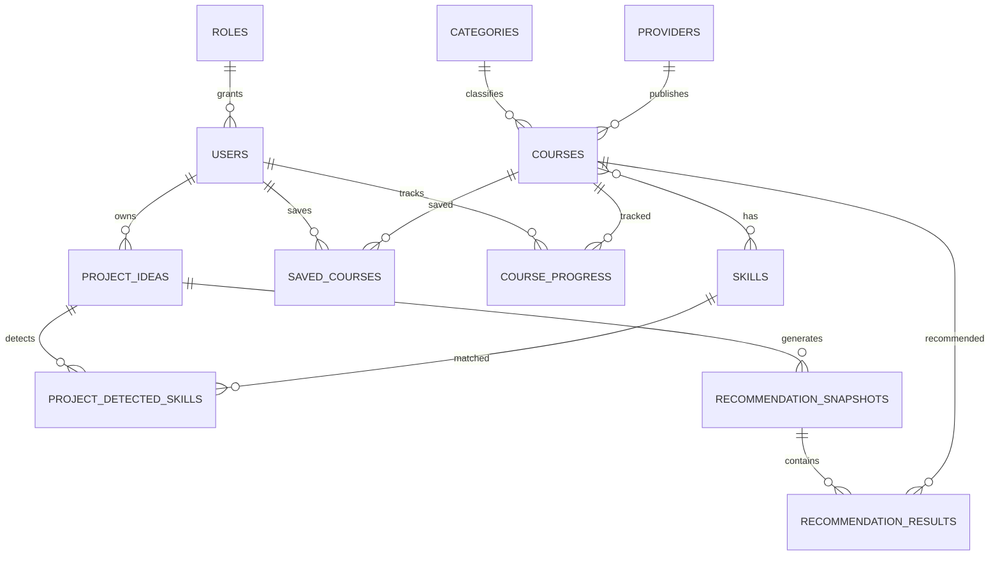

### Figure 7 - Images Big Data fournies dans le projet

Batch:

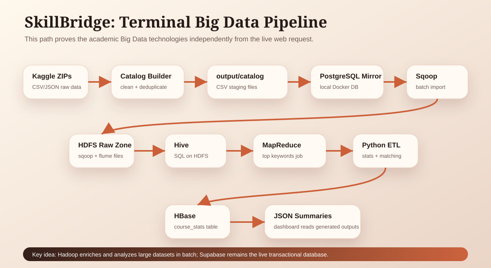

Temps reel:

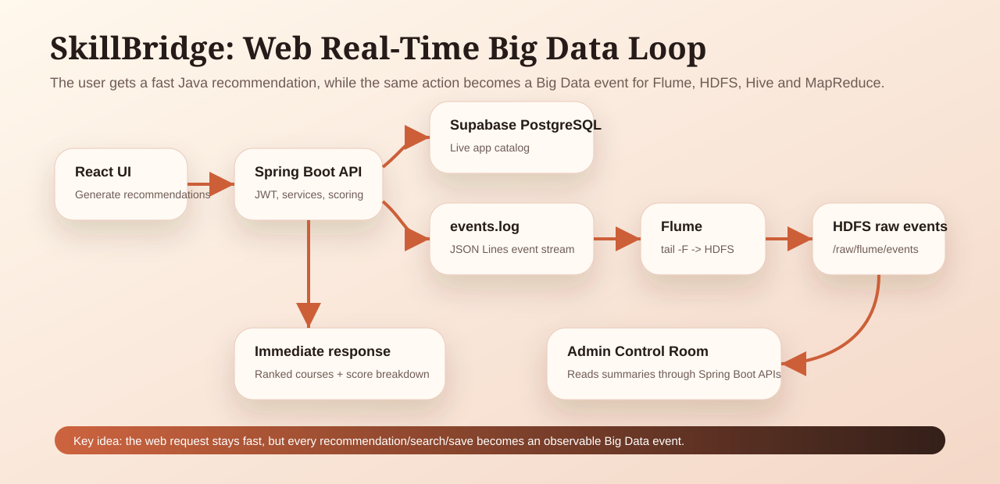

## 3. Structure du repository

```text
SPRING_BIGDATA_PROJECT/
  apps/
    backend/       Spring Boot API, securite, JPA, recommandation
    frontend/      React + Vite, pages utilisateur/admin
    bigdata/       Docker, scripts Python/PowerShell, Hive, HBase, MapReduce
  docs/
    api/           Documentation API
    architecture/  Notes et rapports d'architecture
    database/      Schema et integration Supabase
  README.md        Rapport GitHub principal
```

Modules backend principaux:

- `security`: JWT, OAuth Google/GitHub, brute-force protection, CORS, headers.
- `user`: inscription, login, utilisateur courant, admin users.
- `course`: cours, categories, providers, catalogue public/admin.
- `skill`: competences et recherche.
- `projectidea`: idees de projet.
- `recommendation`: moteur de recommandation rule-based.
- `savedcourse`: sauvegarde des cours.
- `progress`: suivi de progression.
- `bigdata`: lecture des fichiers/logs Big Data.
- `admin`: dashboard, analytics et donnees d'administration.

## 4. Stack technique

| Couche | Technologie | Role |
|---|---|---|
| Frontend | React 19, Vite, TypeScript, Tailwind CSS | Interface utilisateur |
| Routing | React Router | Navigation pages user/admin |
| Charts | Recharts | Visualisation admin Big Data |
| Backend | Java 21, Spring Boot 4 | API REST et logique metier |
| Securite | Spring Security, JWT, OAuth2 JOSE | Auth email, Google, GitHub |
| Database app | Supabase PostgreSQL | Source officielle de l'application |
| ORM | Spring Data JPA / Hibernate | Acces aux tables |
| Big Data batch | Sqoop, HDFS, Hive, MapReduce | Import et analyse batch |
| Big Data streaming | Flume | Ingestion des evenements web |
| Serving analytics | HBase + JSON reports | Stats finales et dashboard |
| Scripts | Python, PowerShell, Bash | Build catalogue et execution pipeline |
| Docker | docker compose | Environnement Big Data local |

## 5. Configuration env

Les fichiers `.env` sont locaux et ne doivent pas etre commites. Ils sont ignores par Git.

Backend attendu dans `apps/backend/.env`:

```env
SPRING_PROFILES_ACTIVE=dev
SERVER_PORT=8081
DB_URL=jdbc:postgresql://aws-0-eu-west-1.pooler.supabase.com:5432/postgres?sslmode=require
DB_USERNAME=postgres.<project-ref>
DB_PASSWORD=<supabase-database-password>
JWT_SECRET=<long-random-secret>
CORS_ALLOWED_ORIGINS=http://localhost:5173
ADMIN_EMAIL=admin@skillbridge.local
ADMIN_PASSWORD=<local-admin-password>
GOOGLE_ALLOWED_AUDIENCES=<google-client-id>
GITHUB_CLIENT_ID=<github-client-id>
GITHUB_CLIENT_SECRET=<github-client-secret>
GITHUB_REDIRECT_URI=http://localhost:5173/login
```

Frontend attendu dans `apps/frontend/.env`:

```env
VITE_API_BASE_URL=http://localhost:8081
VITE_GOOGLE_CLIENT_ID=<google-client-id>
VITE_GITHUB_CLIENT_ID=<github-client-id>
VITE_GITHUB_REDIRECT_URI=http://localhost:5173/login
```

Big Data attendu dans `apps/bigdata/.env` si besoin:

```env
BIGDATA_DB_HOST=localhost
BIGDATA_DB_PORT=5433
BIGDATA_DB_NAME=skillbridge
BIGDATA_DB_USER=skillbridge
BIGDATA_DB_PASSWORD=skillbridge
SKILLBRIDGE_DATASET_FINAL_ZIP=C:\Users\<user>\Downloads\archive (1).zip
SKILLBRIDGE_DATASET_ALL_COURSES_ZIP=C:\Users\<user>\Downloads\archive.zip
SKILLBRIDGE_DATASET_RICH_ZIP=C:\Users\<user>\Downloads\archive (2).zip
```

Note importante: le mot de passe base de donnees doit rester dans `DB_PASSWORD`, pas dans l'URL JDBC.

## 6. Frontend et parcours utilisateur

Le frontend est organise autour de pages fonctionnelles:

| Page | Route | Role |
|---|---|---|
| Login | `/login` | Connexion email/password, Google OAuth, GitHub OAuth |
| Register | `/register` | Creation compte |
| Dashboard | `/dashboard` | Resume utilisateur, prompt rapide, cours populaires |
| Courses | `/courses` | Recherche catalogue, filtres, sauvegarde, tracking |
| Projects | `/projects` | Creation et liste des idees |
| Project detail | `/projects/:id` | Generation et affichage des recommandations |
| Saved courses | `/saved-courses` | Cours sauvegardes |
| Progress | `/progress` | Statut et pourcentage de progression |
| Admin overview | `/admin` | KPIs et analytics |
| Admin catalog | `/admin/courses`, `/admin/categories`, `/admin/providers`, `/admin/skills` | CRUD catalogue |
| Big Data status | `/admin/bigdata` | Etat pipeline, commandes, fichiers, evenements |

### Figure 8 - Navigation frontend

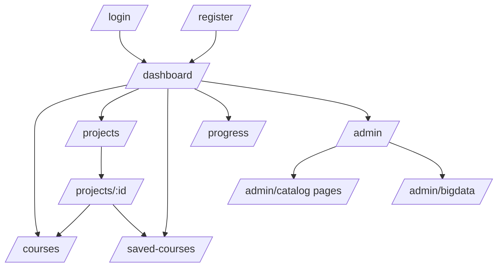

## 7. Backend et API

Le backend expose une API REST securisee:

| Domaine | Endpoints principaux |
|---|---|
| Auth | `POST /api/auth/register`, `POST /api/auth/login`, `POST /api/auth/google`, `POST /api/auth/github` |
| User | `GET /api/users/me` |
| Catalogue public | `GET /api/courses`, `GET /api/categories`, `GET /api/providers`, `GET /api/skills` |
| Projets | `POST /api/projects`, `GET /api/projects`, `GET /api/projects/{id}` |
| Recommandations | `POST /api/projects/{id}/recommendations/generate`, `GET /api/projects/{id}/recommendations` |
| Saved courses | `GET /api/saved-courses`, `POST /api/saved-courses/{courseId}`, `DELETE /api/saved-courses/{courseId}` |
| Progress | `GET /api/progress`, `PUT /api/progress/{courseId}` |
| Admin | `GET /api/admin/overview`, CRUD catalogue, users |
| Big Data | `GET /api/bigdata/status`, `/catalog-summary`, `/events/latest`, `/hive/summary`, `/mapreduce/top-keywords`, `/hbase/course-stats` |

### Figure 9 - Securite API

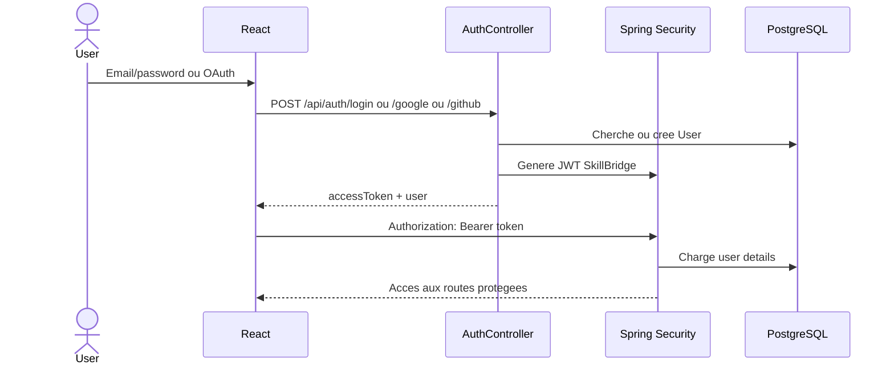

Regles importantes:

- routes publiques: auth et lecture catalogue;
- routes utilisateur: necessitent JWT;
- routes admin: necessitent role `ADMIN`;
- donnees utilisateur: filtrees par proprietaire cote service;
- lockout login: limite les tentatives ratees;
- CORS: origine frontend explicite.

## 8. Base de donnees

Supabase est utilise uniquement comme PostgreSQL. Le projet n'utilise pas Supabase Auth pour le workflow principal.

Tables principales:

| Table | Role |
|---|---|
| `users`, `roles` | Comptes, roles admin/user |
| `providers`, `categories`, `skills` | Dimensions catalogue |
| `courses`, `course_skills` | Catalogue et competences |
| `project_ideas` | Idees utilisateur |
| `project_detected_skills` | Skills detectes pour un projet |
| `recommendation_snapshots` | Snapshot de generation |
| `recommendation_results` | Cours recommandes et scores |
| `saved_courses` | Cours sauvegardes |
| `course_progress` | Progression utilisateur |

## 9. Pipeline Big Data

Le pipeline Big Data est volontairement terminal-first. Il prouve les technologies Big Data sans bloquer les requetes web normales.

### 9.1 Donnees sources

Le builder catalogue lit des ZIP de datasets:

- `final_cleaned_dataset.csv`
- `all_courses.csv`
- `processed_coursera_data.json`
- `edx_courses.json`

Le rapport local actuel indique:

| Element | Count |
|---|---:|
| Unified courses generes | 17 072 |
| Providers | 459 |
| Categories | 12 |
| Skills | 13 647 |
| Course-skill links | 104 006 |
| Cours visibles via backend live | 17 075 |

### 9.2 Role de chaque technologie

| Technologie | Role dans SkillBridge |
|---|---|
| Python | Nettoyer, fusionner, dedupliquer et enrichir les datasets |
| Supabase PostgreSQL | Base officielle de l'application |
| PostgreSQL mirror Docker | Source locale stable pour le lab Big Data |
| Sqoop | Import batch PostgreSQL vers HDFS |
| HDFS | Stockage distribue brut |
| Flume | Streaming des evenements web vers HDFS |
| Hive | Requetes SQL analytiques sur HDFS |
| MapReduce | Calcul des top keywords de recherche |
| HBase | Table serving `course_stats` |
| JSON reports | Pont entre pipeline terminal et dashboard web |

### Figure 10 - Execution Big Data complete

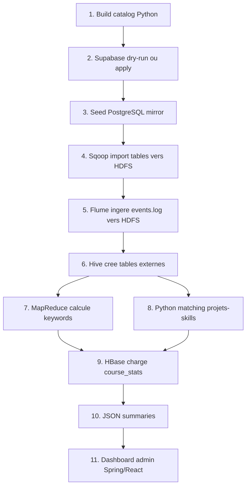

## 10. Pipeline par use case

### Use case 1 - Inscription et login

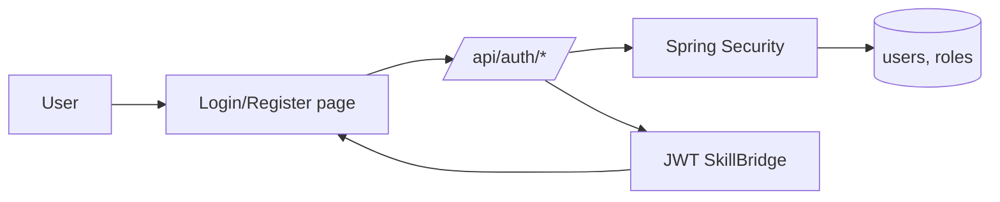

Resultat:

- utilisateur connecte;
- role `USER` ou `ADMIN`;
- JWT ajoute aux appels proteges;
- pas d'evenement Big Data obligatoire.

### Use case 2 - Recherche de cours

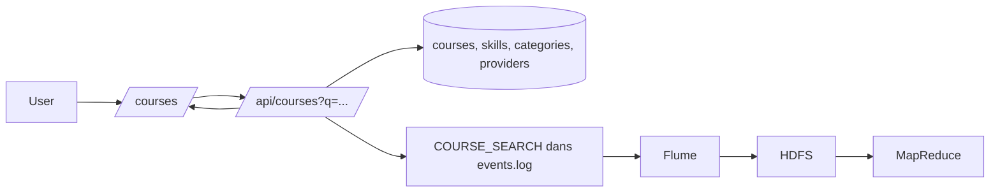

Resultat:

- liste paginee de cours;
- filtres par categorie, provider, skill, niveau;
- evenement `COURSE_SEARCH` ingere par Flume;
- MapReduce peut compter les mots cles les plus recherches.

### Use case 3 - Clic sur un cours

```mermaid
flowchart LR
    User --> Link[Open course]
    Link --> API[/api/courses/{id}/click/]
    API --> Event[COURSE_CLICK dans events.log]
    Event --> Flume --> HDFS
    HDFS --> Hive
    Hive --> HBase[(course_stats)]
```

Resultat:

- le clic n'est pas bloquant pour l'utilisateur;
- l'evenement alimente les statistiques Big Data.

### Use case 4 - Creation d'une idee de projet

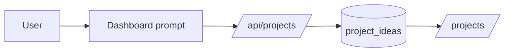

Resultat:

- idee sauvegardee;
- l'utilisateur peut ensuite generer les recommandations.

### Use case 5 - Generation de recommandations

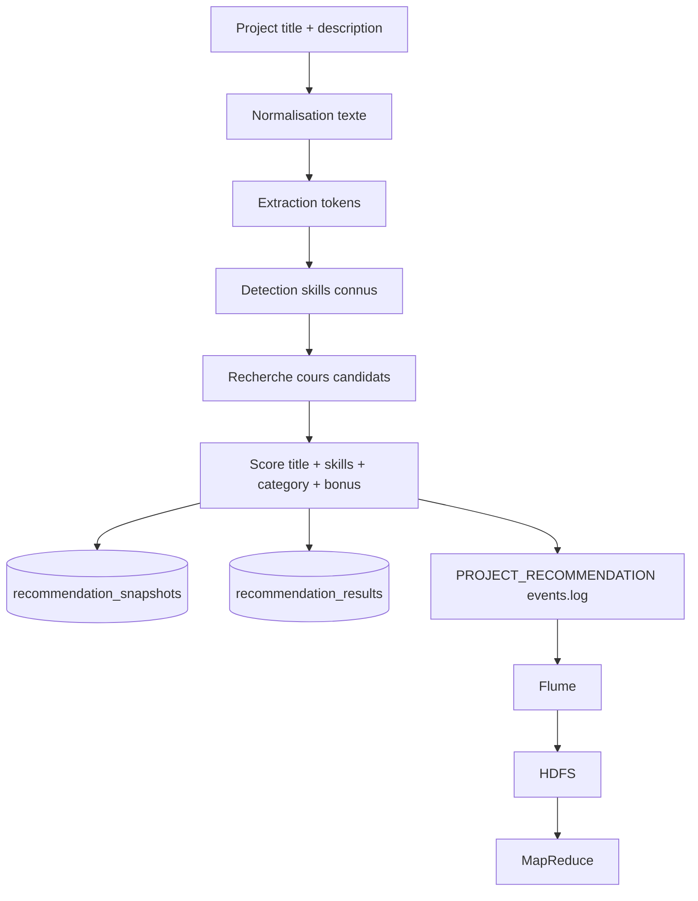

Scoring:

| Score | Role |
|---|---|
| title match | Similarite avec le titre du cours |
| skill match | Overlap entre skills detectes et skills du cours |
| category match | Categorie compatible avec le projet |
| bonus | Popularite catalogue et stats Big Data disponibles |

Resultat:

- recommandations explicables;
- snapshot sauvegarde pour audit;
- evenement Big Data pour analytics.

### Use case 6 - Sauvegarder un cours

```mermaid
flowchart LR
    User --> SaveButton[Save course]
    SaveButton --> API[/api/saved-courses/{courseId}/]
    API --> DB[(saved_courses)]
    DB --> SavedPage[/saved-courses/]
    DB --> HBaseLoad[HBase load optionnel]
```

Resultat:

- cours retrouve dans l'espace utilisateur;
- peut etre utilise dans les stats de popularite/progression.

### Use case 7 - Suivi de progression

```mermaid
flowchart LR
    User --> ProgressPage[/progress/]
    ProgressPage --> API[/api/progress/{courseId}/]
    API --> DB[(course_progress)]
    DB --> HBase[(course_stats via pipeline)]
```

Resultat:

- status `NOT_STARTED`, `STARTED` ou `COMPLETED`;
- pourcentage de progression;
- agregations disponibles pour analytics.

### Use case 8 - Admin catalogue

```mermaid
flowchart LR
    Admin --> AdminCatalog[/admin/courses etc./]
    AdminCatalog --> API[Admin APIs]
    API --> Security[@PreAuthorize ADMIN]
    Security --> DB[(catalog tables)]
    DB --> PublicCatalog[/courses/]
```

Resultat:

- CRUD categories, providers, skills, courses;
- controle role admin;
- catalogue public mis a jour.

### Use case 9 - Dashboard Big Data admin

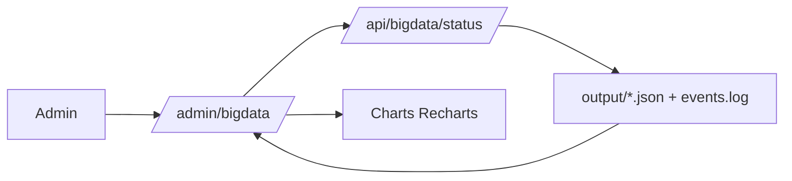

Resultat:

- affichage des fichiers disponibles;
- derniers evenements;
- commandes terminal pour relancer Hadoop;
- resume Hive, MapReduce, HBase.

## 11. Commandes de lancement

### Backend

```powershell
cd C:\Users\omare\OneDrive\Desktop\SPRING_BIGDATA_PROJECT\apps\backend
..\..\mvnw.cmd spring-boot:run
```

Backend attendu:

```text
http://localhost:8081
```

### Frontend

```powershell
cd C:\Users\omare\OneDrive\Desktop\SPRING_BIGDATA_PROJECT\apps\frontend
npm install
npm run dev -- --host localhost --port 5173
```

Frontend attendu:

```text
http://localhost:5173
```

### Big Data complet

```powershell
cd C:\Users\omare\OneDrive\Desktop\SPRING_BIGDATA_PROJECT\apps\bigdata
powershell -ExecutionPolicy Bypass -File .\scripts\18_run_full_terminal_lab.ps1 -Project "secure Spring Boot backend with JWT and PostgreSQL"
```

### Verification liaison application Big Data

```powershell
cd C:\Users\omare\OneDrive\Desktop\SPRING_BIGDATA_PROJECT\apps\bigdata
powershell -ExecutionPolicy Bypass -File .\scripts\20_verify_app_bigdata_link.ps1 -BackendUrl http://localhost:8081 -MinimumCourses 1000
```

## 12. Verification locale

Verification effectuee le 2026-05-20.

| Verification | Commande | Resultat |
|---|---|---|
| Backend tests | `.\mvnw.cmd -f apps\backend\pom.xml test` | OK, 4 tests |
| Frontend build | `npm run build` | OK, bundle JS ~745 kB, warning chunk size |
| Frontend lint | `npm run lint` | KO, 12 erreurs ESLint existantes |
| Big Data Python syntax | `python -m compileall apps\bigdata\scripts` | OK |
| MapReduce Maven | `mvnw -f mapreduce\pom.xml test` | OK, pas de tests |
| Backend live | `GET /api/courses?page=0&size=1` | OK, 17 075 cours visibles |
| Admin login | `POST /api/auth/login` | OK, role ADMIN |
| Big Data status API | `GET /api/bigdata/status` | OK |
| Liaison app Big Data | `20_verify_app_bigdata_link.ps1` | OK, 17 075 cours visibles |

Erreurs lint frontend a traiter:

- `react-refresh/only-export-components` dans `AuthContext.tsx`;
- `no-explicit-any` dans `ChartComponents.tsx`;
- `no-unused-expressions` dans `AdminCatalogPage.tsx`;
- `_analyticsData` non utilise dans `BigDataStatusPage.tsx`;
- regle stricte `react-hooks/set-state-in-effect` sur plusieurs pages.

## 13. Points forts et limites

### Points forts

- Architecture claire: React -> Spring Boot -> PostgreSQL.
- Pas d'acces direct frontend vers la base applicative.
- Auth email, Google et GitHub.
- Catalogue riche et volumineux.
- Recommandations explicables, sauvegardees en base.
- Pipeline Big Data complet avec batch, streaming, SQL analytique, MapReduce et HBase.
- Dashboard admin connecte aux artefacts Big Data.
- Documentation et scripts de demo deja presents.

### Limites actuelles

- Le pipeline Hadoop reste terminal-first, pas execute automatiquement depuis l'API.
- Le frontend lint doit etre nettoye avant CI stricte.
- Le bundle frontend est gros; code-splitting recommande.
- Le script MapReduce parse le JSON avec regex; un parser JSON serait plus robuste.
- Certains titres de cours multilingues peuvent afficher des problemes d'encodage dans le terminal Windows, meme si les donnees restent exploitables.

## Conclusion

SkillBridge est a la fois:

1. une application web complete pour transformer une idee en parcours de formation;
2. un projet JEE/Spring Boot avec securite, API REST, JPA et frontend React;
3. un lab Big Data demonstrable avec Sqoop, HDFS, Flume, Hive, MapReduce et HBase;
4. une architecture defendable en presentation parce que chaque use case a un flux clair, stocke, verifiable et explique.

