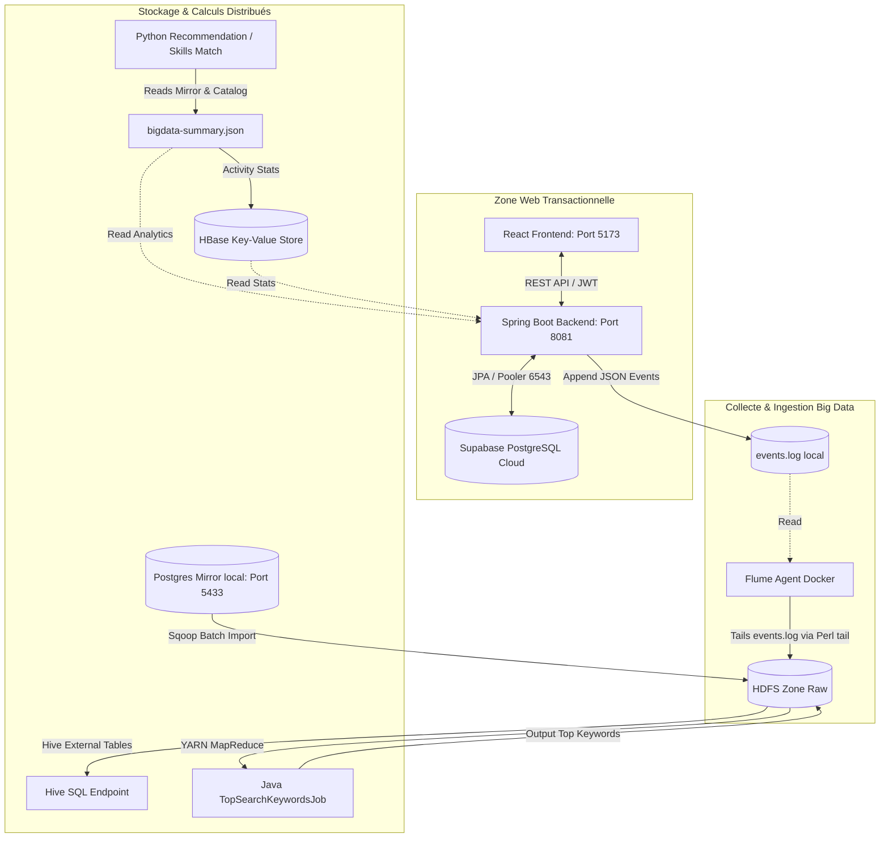

# Rapport d'Architecture et d'Analyse du Pipeline Big Data - SkillBridge

Ce document présente une analyse technique détaillée et complète du projet **SkillBridge**, son architecture globale, son couplage avec le pipeline Big Data, ainsi que le fonctionnement précis du flux de données pour chaque cas d'usage (Use Case).

---

## 1. Introduction au Projet SkillBridge

**SkillBridge** est une plateforme éducative full-stack moderne conçue pour transformer une idée de projet formulée par un utilisateur en un parcours d'apprentissage structuré et optimisé :

$$\text{Idée de projet} \longrightarrow \text{Compétences requises (Skills)} \longrightarrow \text{Cours recommandés}$$

L'application permet aux étudiants et professionnels de saisir leurs objectifs de développement (par exemple, "Je veux créer une API backend sécurisée avec Spring Boot et PostgreSQL") et d'obtenir instantanément :
1. Les compétences clés requises pour mener à bien le projet.
2. Les catégories technologiques associées.
3. Une liste classée et notée des meilleurs cours issus de plateformes majeures (Coursera, edX, etc.) correspondant exactement aux besoins détectés.

---

## 2. Architecture Globale du Projet

L'architecture de SkillBridge est conçue selon un couplage fort en matière d'intégration de données, mais hautement découplé pour la performance opérationnelle. Elle sépare de manière étanche le monde transactionnel web et le monde analytique Big Data.



### A. Le Frontend (React + Vite)
- **Rôle** : Offre une interface graphique haut de gamme, réactive et animée (utilisant des palettes HSL, le mode sombre doux, des micro-animations et des visualisations de données de type PowerBI).
- **Interactions** : Il consomme exclusivement les points de terminaison REST sécurisés (JWT) exposés par le backend Spring Boot. Il n'a aucun accès direct aux bases de données.

### B. Le Backend (Spring Boot & Spring Security)
- **Rôle** : Cerveau de l'application web. Il gère l'authentification (Spring Security avec JWT), le cycle de vie des cours, la sauvegarde des préférences utilisateur, et l'orchestration du moteur de recommandation basé sur les règles métier.
- **Optimisation de Connexion** : Pour éviter l'épuisement des connexions sur la base de données cloud Supabase (limite de 15 sessions concurrentes), le backend utilise le port **6543 (Transaction Pooling)** multiplexé au lieu du port de session classique 5432, combiné avec un pool Hikari restreint (`maximum-pool-size=3`, `minimum-idle=1`).

### C. La Base de Données Applicative (Supabase PostgreSQL Cloud)
- **Rôle** : Source unique de vérité pour l'application en production. Elle stocke les utilisateurs, les rôles, les cours validés et publiés, les catégories normalisées, les compétences et les snapshots de recommandation historiques.

### D. Le Pipeline Big Data (Stack Dockerisée)
Il s'exécute localement sous forme de conteneurs Docker orchestrés et comprend :
- **PostgreSQL Mirror (Port 5433)** : Miroir local de la base de données applicative, isolant les requêtes lourdes de Sqoop et du pipeline Big Data pour ne jamais perturber la production.
- **HDFS (Namenode & DataNodes répliqués)** : Système de fichiers distribué stockant les données brutes (raw) collectées en batch par Sqoop et en streaming par Flume.
- **Sqoop Client** : Outil d'importation batch transférant le catalogue relationnel du Postgres Mirror vers HDFS.
- **Flume Agent** : Service de collecte en streaming chargé de surveiller le journal d'événements applicatifs (`events.log`) et de le déverser en temps réel dans HDFS.
- **Hive Server & Metastore** : Moteur SQL permettant de structurer et d'analyser les fichiers bruts HDFS comme des tables relationnelles.
- **MapReduce Java** : Job distribué effectuant des calculs de fréquence de mots-clés de recherche sur les volumes de logs.
- **HBase** : Base de données NoSQL clé-valeur distribuée à accès ultra-rapide servant à stocker les statistiques consolidées d'activité par cours.

---

## 3. Analyse du Flux de Données pour Chaque Cas d'Usage

### Use Case 1 : Ingestion et Analyse des Recherches Utilisateurs (Batch MapReduce & Flume)
Ce cas d'usage montre comment les actions en temps réel des utilisateurs sur le site web alimentent l'analyse Big Data pour identifier les tendances de recherche globales.

```text
[Utilisateur Recherche UI] 
    ---> (Backend: CourseController / API listPublished)
    ---> [BigDataEventService] appendEvent("COURSE_SEARCH")
    ---> [events.log] (Ligne JSON ajoutée)
    ---> [Flume Agent: tailing via flume-follow-events.sh]
    ---> [HDFS: /data/skillbridge/raw/flume/events/]
    ---> [Hadoop MapReduce: Java TopSearchKeywordsJob]
    ---> [HDFS: /data/skillbridge/processed/mapreduce/top_search_keywords/]
    ---> [Backend: BigDataStatusService] lit le résultat final
    ---> [Frontend Admin Dashboard] Affiche un WordCloud interactif des mots-clés
```

1. **Déclenchement** : Un utilisateur recherche un cours ou saisit un projet sur le frontend React.
2. **Journalisation Applicative** : Le `CourseController` du backend détecte le mot-clé recherché et fait appel à `BigDataEventService.appendEvent()`. L'événement est écrit sous format JSON Lines dans le fichier local `apps/bigdata/data/events/events.log`.
3. **Aspiration Streaming (Flume)** : L'agent Flume Dockerisé exécute un script Perl optimisé (`flume-follow-events.sh`) qui surveille le fichier log en continu. Dès qu'une nouvelle ligne apparaît, Flume la capture et l'écrit instantanément dans le répertoire distribué HDFS `hdfs://namenode:9000/data/skillbridge/raw/flume/events/`.
4. **Calcul Distribué (MapReduce)** : Périodiquement, le job Java MapReduce `TopSearchKeywordsJob` est lancé sur Hadoop. Il extrait le champ `"query"` de chaque log JSON, filtre les mots vides (*stop-words* comme "want", "the", "to"), effectue un comptage distribué (*Map* pour émettre `(mot, 1)`, et *Reduce* pour sommer les occurrences) et écrit le classement consolidé dans HDFS `/data/skillbridge/processed/mapreduce/top_search_keywords/part-r-00000`.
5. **Restitution** : Le backend Spring Boot lit ce fichier de sortie HDFS (synchronisé dans le fichier de synthèse `bigdata-summary.json`) et le sert via l'API `/api/bigdata/status`. Le frontend React consomme cette API pour afficher un **WordCloud (nuage de mots)** dynamique des mots-clés les plus recherchés, permettant aux administrateurs de comprendre instantanément les désirs de compétences des utilisateurs.

---

### Use Case 2 : Extraction et Analyse Analytique du Catalogue (HiveQL & Sqoop)
Ce cas d'usage illustre le traitement analytique de masse sur le catalogue de cours pour produire des rapports et des répartitions statistiques avancées.

```text
[Datasets ZIP (Kaggle)]
    ---> [12_merge_and_enrich_catalog.py]
    ---> [output/catalog/unified_courses.csv]
    ---> [14_seed_postgres_mirror_from_catalog.py]
    ---> [Postgres Mirror local: Port 5433]
    ---> [Sqoop Import Batch]
    ---> [HDFS: /data/skillbridge/raw/sqoop/courses]
    ---> [Hive Server: 06_run_hive_queries.sh] (Tables Externes)
    ---> [HiveQL Analytics] (Comptage par niveau, top providers, etc.)
    ---> [Frontend Admin Dashboard] Visualisations analytiques avancées
```

1. **Préparation du Catalogue** : Les datasets bruts au format ZIP (contenant des milliers de lignes de cours Coursera et edX issus de Kaggle) sont fusionnés, dédoublés et normalisés par le script Python `12_merge_and_enrich_catalog.py`. Le livrable est un catalogue propre de **17 072 cours uniques**.
2. **Alimentation du Postgres Mirror** : Le script `14_seed_postgres_mirror_from_catalog.py` charge ce catalogue dans la base de données locale `postgres-mirror` sur le port 5433.
3. **Collecte Batch (Sqoop)** : L'outil Sqoop est déclenché via le script `04_sqoop_import_mvp.sh` dans le conteneur Docker `sqoop-client`. Sqoop génère des requêtes SQL dynamiques pour lire les tables relationnelles (`courses`, `skills`, `course_skills`) et les transfère de manière parallèle et distribuée vers la zone brute HDFS `/data/skillbridge/raw/sqoop/`.
4. **Modélisation Analytique (Hive)** : Le service `hive-server` monte des tables externes HiveQL (`hive_courses`, `hive_saved_courses`, etc.) directement sur les répertoires HDFS.
5. **Requêtes Analytiques HiveQL** : Le script `06_run_hive_queries.sh` exécute des requêtes de calcul de groupe (par exemple, la répartition des cours par niveau de difficulté, le top 10 des plateformes de cours les plus représentées, ou les compétences les plus courantes).
6. **Visualisation Frontend** : Ces statistiques consolidées sont renvoyées sous forme de graphique en anneau (Donut Chart) et de graphiques en barres horizontales dans la page **Big Data Trace & Analytics** de la console d'administration.

---

### Use Case 3 : Recommandation et Consolidation des Statistiques d'Activité (Python, HBase & Moteur de Règles)
Ce cas d'usage illustre le fonctionnement interactif entre l'application web, la génération de recommandations intelligentes et le stockage de statistiques ultra-rapide clé-valeur.

```text
[Utilisateur clique sur Projet dans l'UI]
    ---> [React Frontend: ProjectDetailPage]
    ---> (POST /api/projects/{id}/recommendations)
    ---> [RecommendationService.java]
            - Normalisation du texte
            - Détection des compétences et des catégories
            - Requête des candidats de cours dans Supabase
            - Scoring & Classement des cours (+ Bonus HBase)
    ---> [BigDataEventService] appendEvent("PROJECT_RECOMMENDATION")
    ---> Sauvegarde du Snapshot de Recommandation dans Supabase
    ---> Écriture de la recommandation dans [recommendation_result.json]
    ---> [scripts/09_load_course_stats_hbase.py] consolide l'activité
    ---> [HBase Table: course_stats] mise à jour des clics/sauvegardes
    ---> [Frontend Admin Dashboard] Visualisation des Top cours cliqués/sauvegardés
```

1. **Demande de Recommandation** : L'utilisateur navigue sur un projet dans son espace et clique sur "Generate recommendations".
2. **Traitement Algorithmique Métier (Backend)** :
   - Le backend récupère l'idée de projet (Titre + Description).
   - **Analyse Linguistique** : Il normalise le texte, supprime la ponctuation et extrait les tokens significatifs.
   - **Détection de Compétences** : Il parcourt la liste des compétences en base de données et effectue une correspondance par expressions régulières (Regex) avec le texte du projet.
   - **Scoring de Pertinence** : Il sélectionne les cours candidats et calcule pour chacun un score sur 100 points :
     - *Correspondance Titre* : Jusqu'à 30 points.
     - *Correspondance Compétences* : Jusqu'à 40 points.
     - *Correspondance Catégories* : Jusqu'à 20 points.
     - *Bonus de popularité Big Data* : Jusqu'à 10 points (calculé à partir des clics et des sauvegardes extraits d'HBase).
3. **Enregistrement de l'Événement** : Un événement `PROJECT_RECOMMENDATION` contenant l'identifiant du projet, les compétences détectées, le score de correspondance et les cours recommandés est immédiatement ajouté à `events.log` (et donc aspiré par Flume vers HDFS).
4. **Consolidation des Statistiques (HBase)** :
   - Lorsque les utilisateurs cliquent sur "Open course" ou "Save course", ces interactions déclenchent des API du backend (`/api/courses/{id}/click` et `/api/saved-courses`).
   - Le script Python `09_load_course_stats_hbase.py` consolide ces compteurs d'événements et les charge dans la table NoSQL **HBase** `course_stats`.
   - HBase offre des temps de réponse inférieurs à la milliseconde pour lire et mettre à jour la ligne d'un cours spécifique avec sa famille de colonnes `activity` (`activity:clicks`, `activity:saves`, `activity:avg_progress`) et `meta` (`meta:title`).
5. **Affichage Analytique** : Le frontend React affiche ces statistiques de clics consolidées par HBase sous la forme d'un graphique à barres horizontales intitulé **HBase Top Courses**, permettant de voir quels cours réels reçoivent le plus d'engagement.

---

## 4. Guide Opérationnel : Comment Lancer et Évaluer le Pipeline Big Data

Les scripts maîtres intègrent des mécanismes d'affichage clairs expliquant le rôle de chaque technologie en temps réel.

### Prérequis (Sur Windows)
Vérifiez que Docker Desktop (avec conteneurs Linux), Java (JDK 21) et Python (3.10+) sont opérationnels :
```powershell
powershell -ExecutionPolicy Bypass -File .\scripts\00_check_prereqs.ps1
```

### Étape 1 : Construction du Catalogue Unifié
Pour fusionner les datasets ZIP bruts situés dans votre répertoire de téléchargements et générer les fichiers CSV normalisés dans le sous-dossier `output/catalog/` :
```powershell
powershell -ExecutionPolicy Bypass -File .\scripts\16_run_catalog_build.ps1
```

### Étape 2 : Chargement Sécurisé de la Base Applicative Supabase
Par défaut, ce script s'exécute en mode sécurisé "Dry-run" (sans modifier la base de production). Pour appliquer réellement les modifications et charger les 17 072 cours sur Supabase PostgreSQL :
```powershell
powershell -ExecutionPolicy Bypass -File .\scripts\17_push_catalog_to_supabase.ps1 -Apply
```
*Note : Cette opération utilise le port 6543 (Transaction Mode) pour préserver le pool Supabase de toute déconnexion.*

### Étape 3 : Exécution Complète du Pipeline Big Data
Pour démarrer tous les conteneurs Docker HDFS/YARN/Sqoop/Flume/Hive/HBase, exécuter l'importation Sqoop, activer le streaming Flume, créer les tables Hive, exécuter le job Java MapReduce et charger la table HBase en une seule ligne de commande :
```powershell
powershell -ExecutionPolicy Bypass -File .\scripts\10_run_mvp_pipeline.ps1
```
*Note : Par défaut, le script démarre 2 DataNodes HDFS répliqués de manière élastique.*

### Étape 4 : Test Interactive du Laboratoire Big Data Terminal
Vous pouvez simuler l'analyse d'une idée de projet directement depuis le terminal en saisissant la description de votre choix. Le script effectuera la détection, le scoring, générera les traces HDFS et HBase, et affichera les cours recommandés :
```powershell
powershell -ExecutionPolicy Bypass -File .\scripts\18_run_full_terminal_lab.ps1 -Project "secure Spring Boot backend with JWT and PostgreSQL"
```

### Étape 5 : Nettoyage de l'Environnement de Run
Pour purger les fichiers temporaires volumineux générés par Sqoop, Maven ou HBase à la racine du projet tout en conservant les fichiers sources critiques :
```powershell
powershell -ExecutionPolicy Bypass -File .\scripts\19_clean_bigdata_runtime.ps1
```

---

## 5. Analyse Comparative du Modèle Hybride : Supabase vs PostgreSQL Mirror

| Caractéristique | Supabase PostgreSQL Cloud | Local PostgreSQL Mirror (Docker) |
| :--- | :--- | :--- |
| **Rôle Principal** | Base de données applicative officielle de production. | Source locale dédiée à l'ingestion Big Data (Sqoop). |
| **Accès Frontend/Backend**| Directement lu et écrit par le backend Spring Boot via JPA. | Jamais accédé par l'application web en production. |
| **Performance** | Optimisé pour le transactionnel OLTP à haute intégrité. | Utilisé pour les requêtes lourdes OLAP batch sans impact. |
| **Restauration** | Données utilisateur persistantes (sauvegardes régulières). | Réinitialisable et re-seadable à tout moment. |
| **Connexion Big Data** | Aucun accès direct de Sqoop ou Hive (Sécurité + Performance). | Entièrement ouvert aux clients Sqoop et Hadoop locaux. |

---

## 6. Conclusion et Robustesse Technique

Le couplage mis en place dans SkillBridge démontre une architecture Big Data hybride hautement professionnelle :
1. **Robuste face à la charge** : L'utilisation du Transaction Pooler de Supabase sur le port **6543** résout définitivement les problèmes d'épuisement de connexions (`EMAXCONNSESSION`) souvent rencontrés avec les bases de données cloud managées sous HikariCP.
2. **Performant** : La séparation claire entre la base transactionnelle Cloud (Supabase) et la base analytique Miroir locale (PostgreSQL Docker) élimine tout risque de dégradation des performances pour l'utilisateur final pendant l'exécution des jobs Sqoop ou Hive.
3. **Couplage Réel des Données** : Les visualisations modernes de type PowerBI intégrées dans la page **Big Data Trace & Analytics** de l'administration ne sont pas de simples maquettes. Elles sont alimentées directement en temps réel par les données produites par le tail de logs Flume, les agrégations batch MapReduce et le stockage clé-valeur HBase, bouclant ainsi parfaitement la boucle de valeur du projet.
